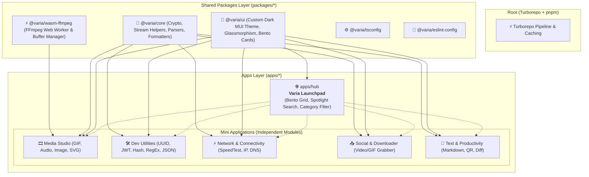

# 🌌 VARIA — Architecture Canvas & Blueprint

> **A modern, minimalist, production-grade toolbox monorepo built with Vite, TypeScript, Turborepo & Custom Material UI.**

---

## 🏛️ 1. Monorepo Architecture Overview



---

## 🔌 2. Plug-and-Play Tool Manifest Contract

Every mini-tool added to the ecosystem follows an isolated manifest contract (preventing Hub bundle bloating via dynamic imports):

```typescript
export type ToolCategory = 'media' | 'dev' | 'network' | 'social' | 'text';

export interface VariaToolManifest<TComponent = unknown> {
  id: string; // e.g. 'tool-audio-converter'
  name: string; // 'MP4 to MP3 Converter'
  description: string;
  category: ToolCategory;
  icon: string; // Lucide / MUI Icon identifier
  tags: string[];
  isOfflineReady: boolean;
  requiresServer?: boolean;
  wasmRequired?: boolean;
  route: string; // '/tools/audio-converter'
  component?: () => Promise<{ default: TComponent }>;
}
```

---

## 🎨 3. Custom Material UI Design System (`@varia/ui`)

* **Deep Obsidian / Zinc Palette**: Background `#09090b`, Card Surface `#18181b` with subtle glowing borders `rgba(255, 255, 255, 0.08)`.
* **Glassmorphism Effects**: `backdrop-filter: blur(16px)` on AppBar, Modals, and Bento Cards.
* **Typography**: `Plus Jakarta Sans` for primary UI elements, `JetBrains Mono` / monospace for Code, UUIDs, and Base64 strings.
* **Bento Grid**: Modular, responsive card layout powering the Hub launchpad at `apps/hub`.

---

## 📚 Related Documentation
* 🧰 **Detailed 20+ Mini-Tools Catalog:** [docs/TOOL_CATALOG.md](./TOOL_CATALOG.md)
* 🏆 **Engineering Standards & CI/CD:** [docs/ENGINEERING_STANDARDS.md](./ENGINEERING_STANDARDS.md)
