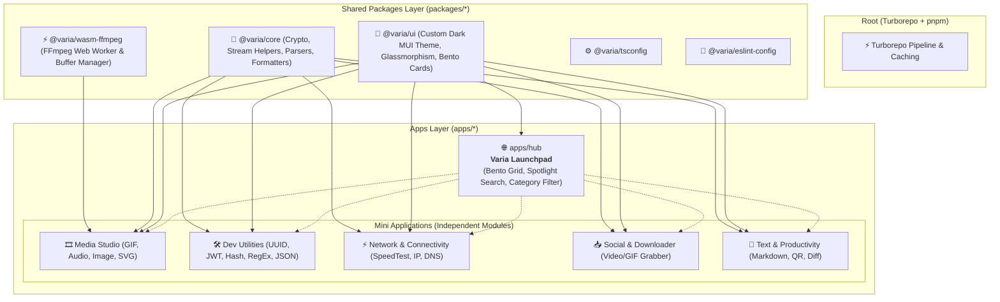

# 🌌 VARIA — Architecture Canvas & Blueprint

> **A modern, minimalist, production-grade toolbox monorepo built with Vite, TypeScript, Turborepo & Custom Material UI.**

---

## 🏛️ 1. Monorepo Architecture Overview



---

## 🔌 2. Plug-and-Play Tool Manifest Contract

Mỗi mini-tool khi được thêm vào hệ thống sẽ tuân theo cấu trúc manifest độc lập (không làm phình code của Hub):

```typescript
export interface VariaToolManifest {
  id: string; // e.g. 'tool-audio-converter'
  name: string; // 'MP4 to MP3 Converter'
  description: string;
  category: 'media' | 'dev' | 'network' | 'social' | 'text';
  icon: string; // Lucide / MUI Icon name
  tags: string[];
  isOfflineReady: boolean;
  wasmRequired?: boolean;
  route: string; // '/tools/audio-converter'
  component: () => Promise<{ default: React.ComponentType }>;
}
```

---

## 🎨 3. Custom Material UI Design System (`@varia/ui`)

* **Bảng màu Deep Obsidian / Zinc**: Background `#09090b`, Card Surface `#18181b` với viền sáng mờ `rgba(255, 255, 255, 0.08)`.
* **Hiệu ứng Glassmorphism**: `backdrop-filter: blur(16px)` cho Appbar, Modals, Bento Cards.
* **Typography**: `Plus Jakarta Sans` cho UI chính, `JetBrains Mono` cho Code/UUID/Base64.
* **Bento Grid**: Bố cục dạng thẻ linh hoạt tại `apps/hub`.

---

## 📚 Tài Liệu Chi Tiết Liên Quan
* 🧰 **Danh mục 20+ Mini-tools chi tiết:** [docs/TOOL_CATALOG.md](./TOOL_CATALOG.md)
* 🏆 **Tiêu chuẩn Kỹ thuật & CI/CD:** [docs/ENGINEERING_STANDARDS.md](./ENGINEERING_STANDARDS.md)
